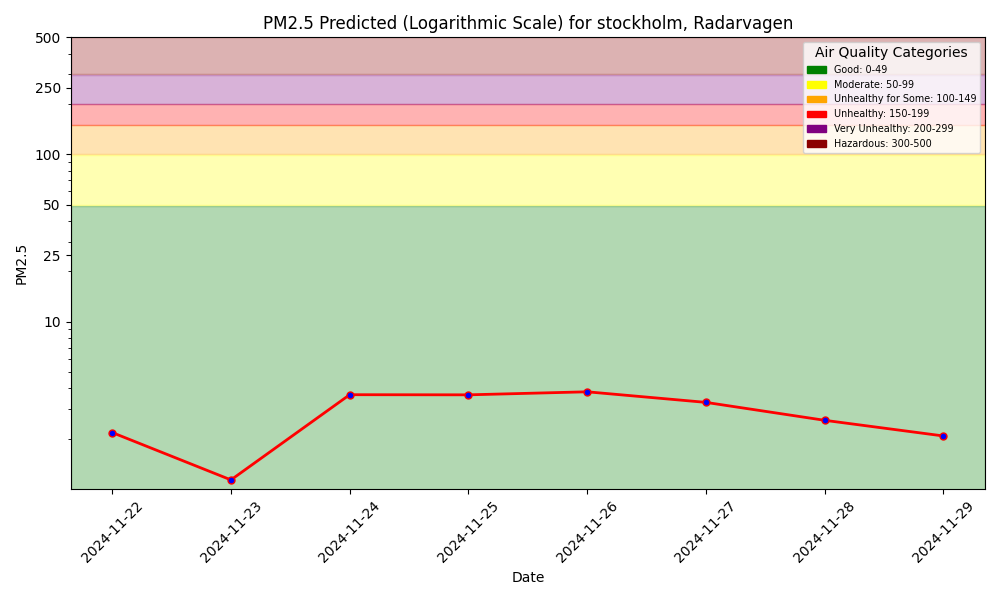
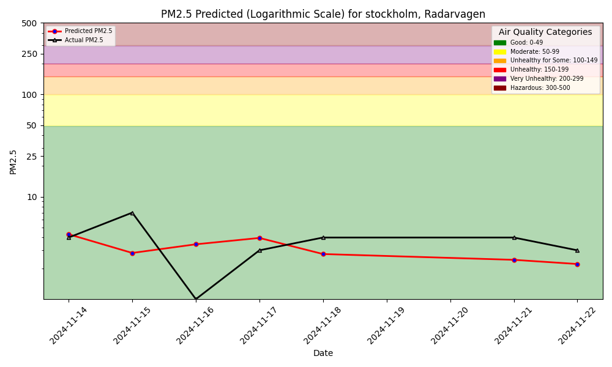

## Predict Air Quality

This project builds an Air Quality Forecasting Service for an Air Quality sensor available at https://waqi.info/.

The output is a forecast for air quality, the image below shows the prediction that we generate for the coming 9 days

We also compare our predicted values for the pm 25 value for the previous days with the actual values to be able to evaluate our model. This is shown below

