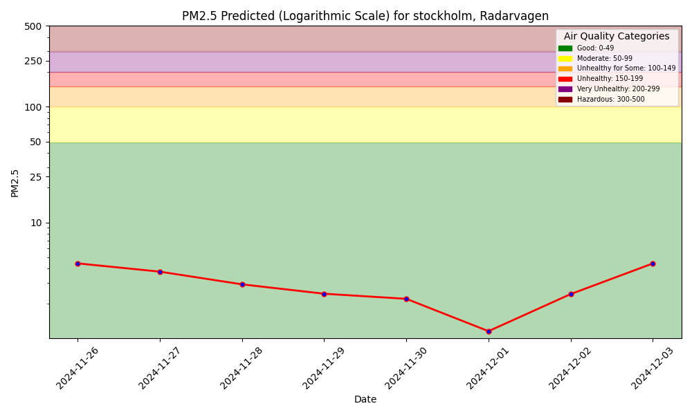
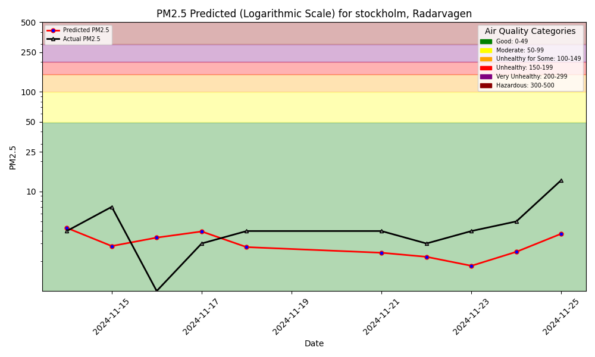

## Predict Air Quality

This project builds an Air Quality Forecasting Service for an Air Quality sensor available at (https://api.waqi.info/feed/A58912). We gather historic data for the air quality (pm 25) for an extensive time period. We do the same for variables that map to weather parameters at the same location for the same time span. Both of the datasets of historic data are loaded to feature groups through Hopsworks, a feature store platform.

The pipeline then run daily to collect values at the specific location for both pm 25 and weather variables. The two feature groups are updated with this new datapoint while maintaining the data from previous days.

We train a decision tree model, more specifically the XGB Regressor, to predict future pm 25 values. The pm 25 value is the target value and we perform supervised learning with the labels of the historic pm 25 values. The features that we use to predict the pm 25 value are several weather variables (wind speed, direction, rain and temp). We extend our model to also include the mean of the pm 25 value from the previous 3 days. When analyzing the feature importance it is evident that this means holds the most predictive power. Through the implementation of the mean as a new feature we manage to lower the mse from 5.337 to 5.311.

We set our pipeline to run once a day where we collect the daily data and then run our trained model on this new data. Note that we don't retrain our model each day. We plot the prediction of the pm 25 values for the coming 9 days in teh plot below

We also compare our predicted values for the pm 25 value for the previous days with the actual values to be able to evaluate our model. This is shown below

